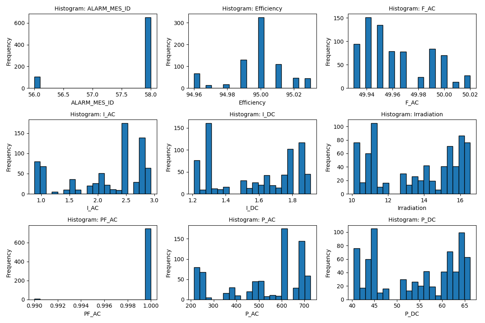

# AHOY-DTU-Visualizer
Simple Visualizer for [AHOY-DTU](https://ahoydtu.de/) and [GitHub](https://github.com/lumapu/ahoy?tab=readme-ov-file).
Values are shown live in tachometer form. Values are stored as JSON with time stamp in SQLite database in advanced case.


Install requirements.txt

* `pip install --upgrade -r requirements.txt`

Run AhoyDTU_Tacho_Live_Save.py for a while and use f.e. [SQLite-Studio](https://sqlitestudio.pl/) to view produced ahoydtu.sqlite file.

Use AhoyDTU_SQLite_Plot_and_Stats.py to have a time series visualization, histogram and descriptive stats.




Sample descriptive statistics
```
No static curves found.

Descriptive statistics for dynamic curves:

ALARM_MES_ID:
  Count: 755
  Mean: 57.72
  Std Dev: 0.69
  Median: 58.00
  Min: 56.00
  Max: 58.00

Efficiency:
  Count: 755
  Mean: 95.00
  Std Dev: 0.02
  Median: 95.00
  Min: 94.96
  Max: 95.03

F_AC:
  Count: 755
  Mean: 49.96
  Std Dev: 0.03
  Median: 49.95
  Min: 49.93
  Max: 50.02

I_AC:
  Count: 755
  Mean: 2.14
  Std Dev: 0.68
  Median: 2.50
  Min: 0.88
  Max: 2.94

I_DC:
  Count: 755
  Mean: 1.57
  Std Dev: 0.25
  Median: 1.63
  Min: 1.21
  Max: 1.91

Irradiation:
  Count: 755
  Mean: 13.52
  Std Dev: 2.26
  Median: 14.02
  Min: 10.10
  Max: 16.55

PF_AC:
  Count: 755
  Mean: 1.00
  Std Dev: 0.00
  Median: 1.00
  Min: 0.99
  Max: 1.00

P_AC:
  Count: 755
  Mean: 526.19
  Std Dev: 169.71
  Median: 613.60
  Min: 213.80
  Max: 726.50

P_DC:
  Count: 755
  Mean: 54.08
  Std Dev: 9.05
  Median: 56.10
  Min: 40.40
  Max: 66.20

Q_AC:
  Count: 755
  Mean: 23.64
  Std Dev: 0.34
  Median: 23.50
  Min: 23.10
  Max: 24.40

Temp:
  Count: 755
  Mean: 45.18
  Std Dev: 4.13
  Median: 43.70
  Min: 42.70
  Max: 55.50

U_AC:
  Count: 755
  Mean: 245.65
  Std Dev: 1.06
  Median: 245.80
  Min: 243.30
  Max: 247.20

U_DC:
  Count: 755
  Mean: 34.37
  Std Dev: 0.57
  Median: 34.70
  Min: 33.30
  Max: 35.00

YieldDay:
  Count: 755
  Mean: 229.45
  Std Dev: 17.21
  Median: 236.00
  Min: 186.00
  Max: 241.00

YieldTotal:
  Count: 755
  Mean: 291.12
  Std Dev: 0.02
  Median: 291.12
  Min: 291.07
  Max: 291.13

```
